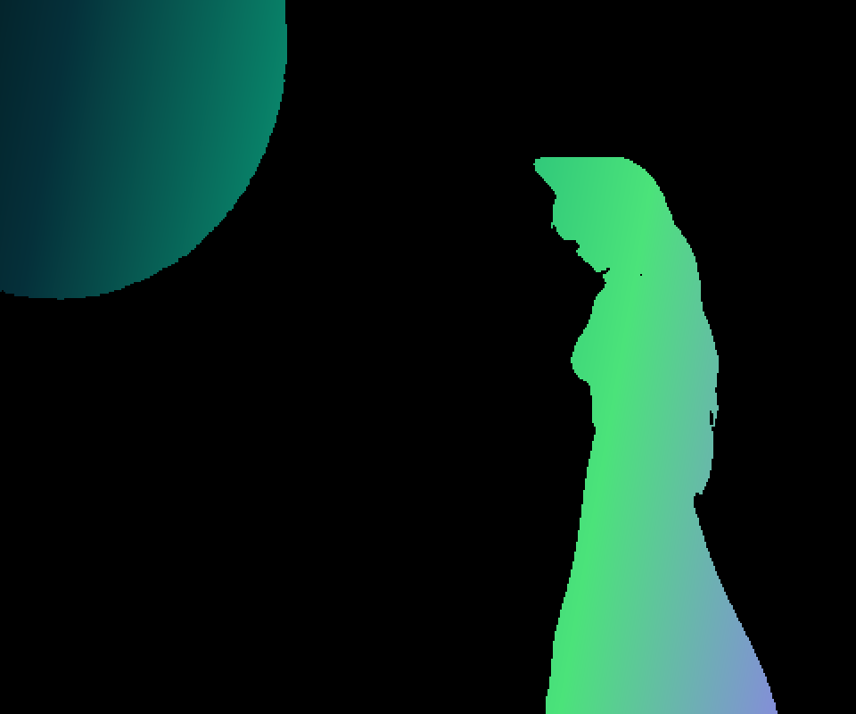
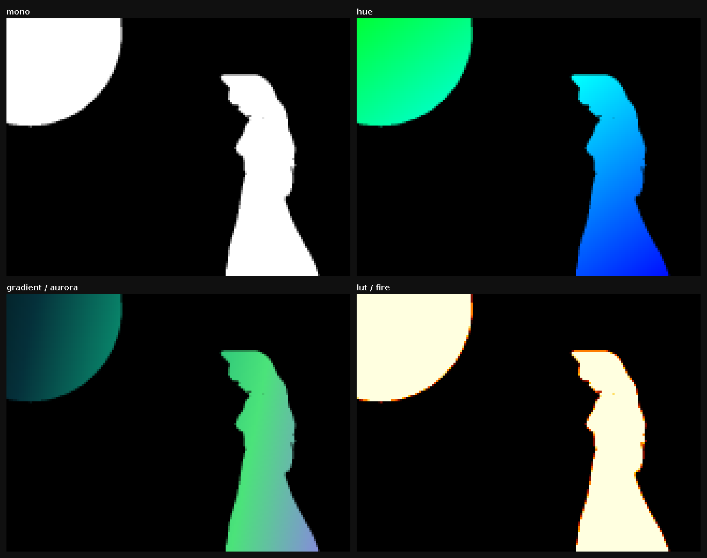

# My Bad Apple

A terminal player for the classic **Bad Apple!!** shadow-art video — written in Java,
built to run anywhere with a single `java -jar`, and to look as good as your terminal allows.



## Highlights

- **Zero native dependencies at runtime.** The video is pre-rendered offline into a small
  embedded asset (1-bit frames + RLE/delta compression), so the player never needs ffmpeg
  or any native libs. Just a JRE — the whole thing is one ~12 MB self-contained jar.
- **Terminal-aware rendering.** Detects what your terminal supports (via env vars *and*
  active ANSI queries) and picks the best backend automatically: kitty/sixel/iTerm image
  protocols where available, Unicode half-blocks (`▀`, two pixels per cell) elsewhere, and
  ASCII as the universal fallback.
- **Original procedural color.** Bad Apple has no source color, so color is *computed* at
  runtime by pluggable colorizers — shape and color stay fully separate, the asset stays
  pure black-and-white, and nothing bleeds.
- **Solid A/V sync.** Audio is the master clock; video frames are selected by timestamp and
  dropped when behind. Pause, seek, and speed controls are live.

## Color modes

Four procedural colorizers, all derived from luminance + position + time. `mono` is the
classic look; `hue` cycles the hue over time; `gradient` projects a palette across space;
`lut` maps a palette through luminance.



## Running

You need a JRE (Java 17+). Build the self-contained jar once, then run it:

```sh
./gradlew shadowJar
java -jar build/libs/my-bad-apple.jar
```

That's it — no ffmpeg, no native libraries, no extra setup.

### Options

| Flag | Description |
|------|-------------|
| `--color <mode>` | `mono` (default), `hue`, `gradient`, `lut` |
| `--palette <name>` | `fire`, `neon`, `aurora`, `ice` — used by `gradient` / `lut` |
| `--renderer <id>` | force a backend: `auto` (default), `kitty`, `sixel`, `iterm`, `halfblock`, `ascii` |
| `--force` | ignore capability detection and trust the chosen renderer |
| `--no-audio` | play without sound |
| `--debug` | print the detected terminal capabilities and exit |
| `-h`, `--help` | show usage |

### Controls

| Key | Action |
|-----|--------|
| `space` | pause / resume |
| `←` / `→` | seek −5s / +5s |
| `↑` / `↓`, `+` / `-` | speed up / slow down |
| `Ctrl-H` | toggle the FPS counter (real presented frames/sec) |
| `q`, `Esc` | quit |

## Terminal support

The player probes the terminal and falls back gracefully, so it runs everywhere.

Auto-selection prefers **half-blocks** because they render fast enough for smooth 30fps with
full truecolor — and on a 1-bit source like Bad Apple they look great:

| Terminal | Auto backend |
|----------|--------------|
| Most truecolor terminals (kitty, foot, Alacritty, Konsole, GNOME Terminal, WezTerm…) | half-blocks, 24-bit color |
| VS Code / IntelliJ integrated terminals | half-blocks, 256 color |
| no UTF-8 / minimal terminals | ASCII |

The image protocols (`kitty`, `iterm`, `sixel`) are higher fidelity but re-encode the whole
frame every frame, so they can't sustain the frame rate. They're available on demand via
`--renderer kitty|iterm|sixel` (great for a paused still), just not auto-selected.

Run with `--debug` to see exactly what was detected, and press `Ctrl-H` during playback to see
the true frame rate plus a per-frame render/write timing breakdown.

## How it works

```
offline (once)                          runtime (java -jar)
──────────────                          ───────────────────
source .mp4                             frames.bin ─┐
   │ ffmpeg → raw gray                              ├─ AssetReader → Frame (1-bit shape)
   │ threshold → 1-bit                              │      │ box-average downscale
   │ RLE + XOR-delta + keyframes                    │      ▼
   ▼                                                │   GrayGrid (anti-aliased luminance)
frames.bin  (committed)                             │      │ Colorizer(x, y, lum, t)
audio.mp3   (committed)                  audio.mp3 ─┘      ▼
                                                        Renderer → terminal
```

The asset format (`BAPL`) stores a 1-bit bitmap per frame, run-length encoded; most frames
are XOR deltas against the previous frame (mostly zeros → tiny), with periodic keyframes that
also serve as seek points. Color never touches the asset — it's a pure function of position,
luminance, and time evaluated as each cell is drawn, so the same black-and-white frames
produce every palette without any stored color or bleed between cells.

## Regenerating the asset

The embedded asset is committed, so you don't need this. To rebuild it from the source video
(the only step that requires `ffmpeg` on your PATH):

```sh
./gradlew generateAsset
```

## Stack

- **[JLine 3](https://github.com/jline/jline3)** — raw keyboard input, terminal size/resize,
  alt-screen, and reading ANSI query responses.
- **[JLayer](http://www.javazoom.net/javalayer/javalayer.html)** — pure-Java MP3 decoding for
  the audio track.

Both are pure Java and bundled into the shadow jar; there are no native dependencies.

---

This is a from-scratch rewrite of an older ASCII-in-Swing version, rebuilt as a proper
terminal player with procedural color and automatic terminal adaptation.
